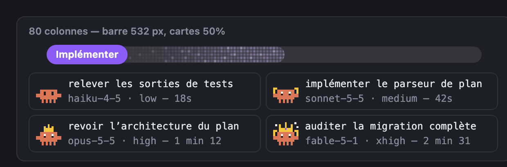

<div align="center">
  

  # marketplace

  **A Claude Code plugin marketplace: keep the implicit written down — roadmap, canon, and orchestration, as plain markdown files in your repo.**

  [](#plugins)
  [](#why)
  [](#why)

</div>

---

Everything worked out in a first pass — what you actually expect, how this module is really tested, which behaviour must never break — is agreed in the conversation and written nowhere. Change the conversation, change the agent, change the machine: it's gone, and you explain it again. **marketplace** ships the skills that make that implicit knowledge a file.

## Plugins

Three independent plugins, installed one by one (see [Installation](#installation)):

| Plugin | Kind | What it gives you | Install |
|---|---|---|---|
| [`orchestration`](#the-orchestration-plugin) | skills + agents | A roadmap and a canon as plain markdown files in your repo, with provenance on every entry; a `scribe` that keeps them, an `orchestrateur` that scopes and delegates, and executors per reasoning effort. | `/plugin install roadmap@marketplace` |
| [`level-design`](#level-design-plugin--3d-level-design-taste-written-down) | skills + agent | 3D level-design taste and build method, engine-agnostic, plus a reviewer that judges screenshots against your canon. | `/plugin install level-design@marketplace` |
| [`session-recap`](#session-recap-mod--see-which-agents-run-on-what-for-how-much) | mod (function hooks) | A live band above the prompt: progress bar of the current plan, workflow phases, one card per running agent (icon by model), plus a pane with timeline, tokens and limits. | `/plugin install session-recap@marketplace` |

## Why

No server, no Docker, no database, no CLI. Every artefact is markdown in your repo (`.claude/roadmap.md`, `.claude/canon/`), read by the agent before it acts and written by the agent when it closes a task. Machine-to-machine sync is `git pull`; team review is a diff.

The file is the format. A server would only ever be a transport — never the other way around.

## The `orchestration` plugin

Two skills and three agent roles (scribe, orchestrator, executors).

### `roadmap-tracker` — the plan as a file

A strict-grammar markdown roadmap: **specs are canon** (the design is already settled, implementation doesn't re-decide), milestones carry an observable Definition of Done, tasks have stable IDs (`ROADMAP:TASK:7`) that are never renumbered or reused, plus claims (`[~] claimed by <user>`) and declared dependencies. Source of truth lives in Claude Code's native auto-memory, mirrored after every edit to `.claude/roadmap.md` so it travels with the repo.

It also carries a Definition of Done per task type — feature, bug, test, doc, infra — each criterion **demonstrated** (command run, output quoted), never asserted.

### `canon-tracker` — the implicit, with provenance

The project canon lives in `.claude/canon/`, one file per theme: `attentes.md` (what you expect from the product), `conventions.md` (how things are done here), `tests.md` (the exact commands and what a healthy output looks like), `invariants.md` (what must never break).

Every entry is one line and carries its source:

```markdown
- `CANON:12` [USER:eddy 2026-08-14] The suite runs with `pytest -q` from the repo
  root; never from a subdirectory (fixtures break).
- `CANON:13` [MODEL 2026-08-14] First run of `tests/test_graph.py` takes ~40 s —
  it downloads the model; later runs are instant.
```

- **`[USER:<name>]`** — said or validated by a human. **Untouchable**: never rewritten, never "improved", never contradicted. A conflict is reported to you and stops there.
- **`[MODEL]`** — inferred by the agent while working. Demoted on sight against any `[USER]` entry, and promoted to `[USER]` only on an explicit confirmation — never because it turned out true a few times.

Nothing is deleted: an entry that goes stale is struck through with its date and reason and stays in place. And it gets filled by a **capture ritual** run at every task closure — "what implicit thing did we work out during this pass?" — so the writing-down isn't left to good intentions.

### `scribe` + `orchestrateur` (agents) — equal peers beside your main agent, executors code

A workflow, made explicit, split in three roles. The main agent (the default one you talk to), the scribe and the orchestrator are **equals**: none is the entry point, and each can message the others directly (short messages that point to IDs and paths, never copies). **No role above the executors ever writes code.**

- **`scribe` — the pen.** It keeps the canon and the roadmap: whoever talks with you sends it the decisions to write down, the orchestrator sends it its findings, and at closure it runs the capture ritual — what implicit thing was settled, and what got stuck in the orchestration itself — and only then ticks the box. It is not a relay, so its context doesn't fill up with copies.
- **`orchestrateur` — delegation and verification.** It splits the scoping file into tasks that each carry an objective, a file perimeter, an executable success criterion and an explicit out-of-scope list, delegates each one choosing the **reasoning effort** by the nature of the work, writes the multi-agent workflow when you explicitly asked for one, and runs every success criterion itself — a delegated agent's report is a claim, not proof. It reports back to whoever called it and sends its findings to the scribe; it never talks to you directly.
- **`executant-low` … `executant-max` — the executors.** Effort can't be passed on a plain subagent call, so the five executors differ only by `effort`: picking the executor picks the effort.

No agent pins a model. The scribe and the orchestrator inherit your session's model; the orchestrator picks a model for each executor on the call — independently of effort, cheapest for mechanical work, most capable for review and hard problems — among the models your settings allow (restrict them with a permission rule such as `Agent(model:…)` in `deny`).

Setup, once per machine:

- nothing to configure: start the session with your usual main agent — the scribe and the orchestrator are summoned as peers when needed.

Before any delegation both agents pass a mandatory read gate over the canon and the roadmap — project specifics (tools, commands, files never to touch) come from there, the agents themselves stay generic.

### `level-design` (plugin) — 3D level-design taste, written down

A second, independent plugin, shaped like [taste-skill](https://github.com/Leonxlnx/taste-skill) but for 3D levels instead of web pages, distilled from a real co-op game project:

- **`level-design-taste`** (skill) — read the brief in one line, set four dials (openness, density, relief, nature), ban the model's defaults (square outlines, tiled flat floors, sprinkled props, lamp carpets, rainbow palettes, enemy models used as props, "done" because the script ran) and pass a measurable pre-flight before showing anything. References for outdoor arenas, interiors, lighting/fog/colour/density, and automatic audits.
- **`level-design-build`** (skill) — the procedure: measure the reference scene instead of eyeballing it, write a spec with three layout concepts and questions for the human, build through an idempotent scripted pass that preserves the human's manual edits, audit, capture from named cameras, review, deliver honestly.
- **`level-design-reviewer`** (agent) — judges screenshots against the project's canon and the spec, ranked blocking / major / minor.

Engine-agnostic: engine and asset-pack specifics belong in your project's canon.

### `session-recap` (mod) — see which agents run, on what, for how much

A plugin built on Claude Code's function hooks (mods). It answers "what is the plan doing, which agents are running on what, which model and effort, and what did it cost?" — live, above your prompt:



*The band at 80 columns (progress bar 532 px, agent cards 2 per row) — rendered by the mod's own code, see `docs/session-recap-preview.html` for every state and size.*

- **Progress bar.** Declared by the orchestrator through the `plan` / `step` tools: a rounded track filled with small animated cells, a badge for the current phase at its start, percentage, steps done, agents done and elapsed time. The colour follows the state — running, waiting for you, error, done — and fades from one to the next.
- **Agent cards.** One small card per active sub-agent: its task, model · effort, current tool and clock. The icon is a pixel-art mascot that evolves with the model tier (bare crab → crown → crowned with accessories) and turns black-and-white once the agent is idle. Cards go 3, 2 or 1 per row depending on the width; the bar uses the whole line.
- **Real workflows.** For a real workflow (`workflow: true`) the band lists each phase with its `n/m agents` and its agents, with placeholder cards for the agents not summoned yet.
- **`/session-recap`** opens a pane: the 5-hour / 7-day limits with a linear forecast, a per-prompt timeline (new, resumed, forked, still running), the agent tree, and tokens by agent × model × effort.
- **Toasts** warn at limit thresholds (80 % / 95 % by default), on per-agent and per-session token budgets, when a sub-agent answers on another model than the one it was spawned on, and when the main agent takes more than a share of the session. `/progress` hides or shows the bars, `/progress-clear` drops the current plan.

Read-only: every hook passes the event on unchanged. Thresholds are plugin options (`claude plugin configure session-recap`). Tested on Claude Code 2.1.287; the mods API is early access and may change between releases.

## Installation

Requires Claude Code. Nothing else — no server, no account.

**1. Add the marketplace** (once per machine):

```
/plugin marketplace add pazimor/marketplace
```

**2. Install the plugins you want**, each one on its own:

```
/plugin install orchestration@marketplace   # roadmap + canon + scribe / orchestrateur / executors
/plugin install level-design@marketplace    # optional: 3D level-design taste and method
/plugin install session-recap@marketplace   # optional: the live band (mod)
```

**3. Restart Claude Code** so the new agents, skills and mod are loaded.

From a terminal the same thing reads `claude plugin marketplace add pazimor/marketplace` then `claude plugin install <name>@marketplace`. To try a local checkout instead, use `claude plugin marketplace add ./` from the repo root. To update later: `claude plugin marketplace update marketplace` then `claude plugin update <name>@marketplace`.

### The mod (`session-recap`)

- Needs **Claude Code ≥ 2.1.287** with function hooks (mods) enabled. Check it with `claude plugin test plugins/session-recap` from a checkout: if hooks modules are turned off for your account, the command says so.
- Nothing to configure. Optional thresholds and budgets: `claude plugin configure session-recap`.
- Open the pane with `/session-recap`; the band above the prompt appears on its own as soon as an agent runs or a plan is declared. For the progress bar and the workflow view, install `orchestration` too — its orchestrator declares the plan and its steps through the mod's `plan` and `step` tools; without it the band still shows the running agents.

### First use of `orchestration`

In your project, ask the agent to initialise the roadmap and the canon — it will create `.claude/roadmap.md` and `.claude/canon/*.md` with empty, honest files (it never back-fills invented history). Commit them: they are the project's memory, and `git` is the sync.

The skills trigger on their own — talk about a milestone, a task, a convention, a test command, or ask for a feature, and the right one loads.

## Repo layout

```
marketplace/
├── .claude-plugin/marketplace.json
├── plugins/
│   ├── roadmap/
│   │   ├── skills/             # roadmap-tracker, canon-tracker
│   │   └── agents/             # scribe, orchestrateur, executant-{low,medium,high,xhigh,max}
│   ├── level-design/
│   │   ├── skills/             # level-design-taste, level-design-build (+ references/)
│   │   └── agents/             # level-design-reviewer
│   └── session-recap/
│       ├── hooks/              # register.tsx (hooks module), recap.ts (pure model)
│       ├── types/              # state contract declared to the engine
│       └── tests/              # claude plugin test plugins/session-recap
├── docs/grammar.md             # formal grammar of the canon and roadmap files
├── scripts/validate.py         # stdlib validator — run it on any project using the plugin
├── market-mem/                 # auth skeleton kept for the M4 team server, no features
├── CHANGELOG.md
└── .claude/                    # this project's own roadmap and canon, dogfooded
```

Check a project's roadmap and canon files: `python3 scripts/validate.py <project-root>`.

