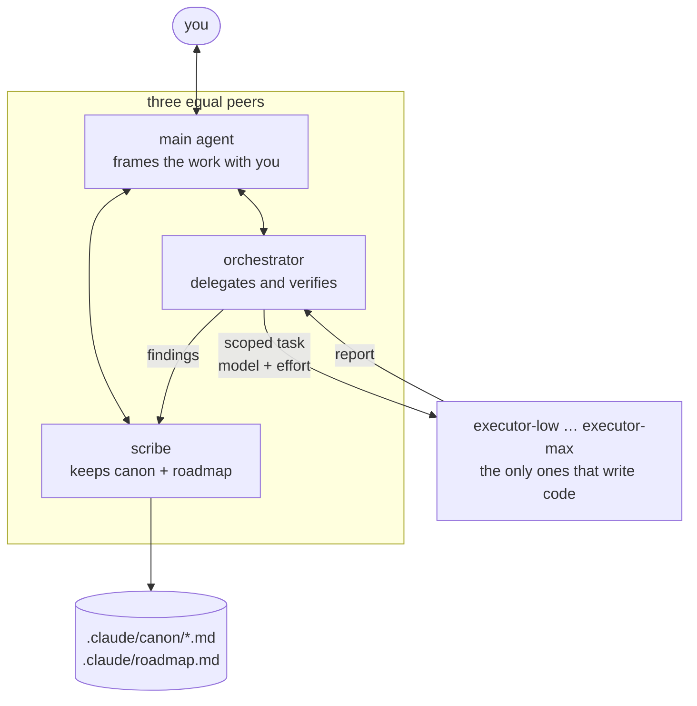

<div align="center">
  

  ### Experiments and tools for getting the most out of AI.

  This repo is my lab: I try things with Claude Code, measure them,<br/>and keep what makes the AI work better, cost less and forget nothing — as plugins you can install.

  [](#plugins)
  [](#plugins)
  [](#orchestration)

</div>

---

## Plugins

Add the marketplace once, then install the plugins you want, one by one:

```
/plugin marketplace add pazimor/marketplace
```

| Plugin | What it does | Install |
|---|---|---|
| [`orchestration`](#orchestration) | Canon and roadmap as markdown files in your repo, and three agent roles that frame, delegate and verify. | `/plugin install orchestration@marketplace` |
| [`level-design`](#level-design) | Taste and method for building 3D levels, plus a reviewer that judges screenshots. | `/plugin install level-design@marketplace` |
| [`agents-info`](#agents-info) | A live band above the prompt: plan progress, running agents, tokens and limits. | `/plugin install agents-info@marketplace` |

Restart Claude Code after installing. From a terminal: `claude plugin marketplace add pazimor/marketplace`, then `claude plugin install <name>@marketplace`; update with `claude plugin marketplace update marketplace` then `claude plugin update <name>@marketplace`.

## orchestration

What you settle with the AI — what you expect, how things are tested, what must never break — ends up in files, and the work is split between agents that each do one job.



- **Canon** — `.claude/canon/*.md`, one theme per file. Every entry carries its source: `[USER:<name>]` is untouchable, `[MODEL]` is inferred and gives way to the user. A stale entry is struck through with its date and reason.
- **Roadmap** — specs, milestones with a Definition of Done, tasks with stable IDs, claims and dependencies. It lives in Claude Code's auto-memory and is mirrored to `.claude/roadmap.md`.
- **scribe** — writes both, and runs a capture ritual at each task closure: what implicit thing was settled during this pass? It runs on the most economical model.
- **orchestrator** — splits the framing brief into scoped tasks, picks the model and the reasoning effort of each one, and runs every success criterion itself, never trusting only the executor's own tests.
- **executor-low … executor-max** — identical except for their reasoning effort.
- **Validator** — `python3 scripts/validate.py <project>` checks the canon and roadmap grammar of any project.

```markdown
- `CANON:12` [USER:eddy 2026-08-14] The suite runs with `pytest -q` from the repo root.
- `CANON:13` [MODEL 2026-08-14] The first run of `tests/test_graph.py` takes ~40 s.
```

## level-design

Ask an AI for a level and you get a square arena on a tiled floor, props sprinkled like confetti, a carpet of lamps and every hue of the rainbow. **`level-design` gives it taste** — distilled from a real co-op game project.

- **`level-design-taste`** — reads the brief in one line, sets four dials (openness, density, relief, nature), bans the AI tells, and passes a measurable pre-flight before showing you anything.
- **`level-design-build`** — measures the reference scene, writes a spec with three layout concepts and questions for you, builds through a scripted pass that keeps your manual edits, then audits, captures and reviews.
- **`level-design-reviewer`** — judges screenshots against your canon and the spec: blocking, major, minor.

Engine-agnostic: no engine named, no absolute distances — everything is measured in modules of your own kit.

## agents-info


- **Progress bar** — the plan declared by the orchestrator (`plan` / `step` tools): current phase, steps, agents, elapsed time; its color follows the state (running, waiting for you, error, done).
- **Agent cards** — task, model · effort, current tool and clock, with a pixel-art mascot picked by the agent (`mascot:` in its frontmatter) or by its model tier.
- **Workflows** — each phase with its `n/m agents`, and placeholder cards for the agents still to come.
- **`/agents-info` pane** — 5-hour and 7-day limits with their forecast to the reset; the agent tree, where the main agent, the scribe and the orchestrator sit side by side, each card with its worked time and its usage bar; a per-prompt timeline (new, resumed, forked); the session's usage per model × effort. Each section folds.
- **Toasts** — limit thresholds (80 % / 95 %), token budgets per agent and per session, a sub-agent answering on another model, a main agent taking too large a share.
- **`/progress`** hides or shows the bars, **`/progress-clear`** drops the current plan.


Read-only: it observes, it never blocks. Options: `claude plugin configure agents-info`. Needs Claude Code ≥ 2.1.287 with mods (function hooks), an API still in early access. Both pictures are drawn by the mod's own code (`scripts/preview-agents-info.mts`).

## Repo layout

```
marketplace/
├── .claude-plugin/marketplace.json
├── plugins/
│   ├── orchestration/
│   │   ├── skills/             # roadmap-tracker, canon-tracker
│   │   └── agents/             # scribe, orchestrator, executor-{low,medium,high,xhigh,max}
│   ├── level-design/
│   │   ├── skills/             # level-design-taste, level-design-build (+ references/)
│   │   └── agents/             # level-design-reviewer
│   └── agents-info/
│       ├── hooks/              # register.tsx (hooks module), recap.ts (pure model)
│       ├── types/              # state contract declared to the engine
│       └── tests/              # claude plugin test plugins/agents-info
├── docs/                       # canon + roadmap grammar, mod previews
├── scripts/                    # validate.py, preview generators
├── tools/                      # skill usage audit, benchmark method
├── CHANGELOG.md
└── .claude/canon/              # this project's own canon, dogfooded
```
